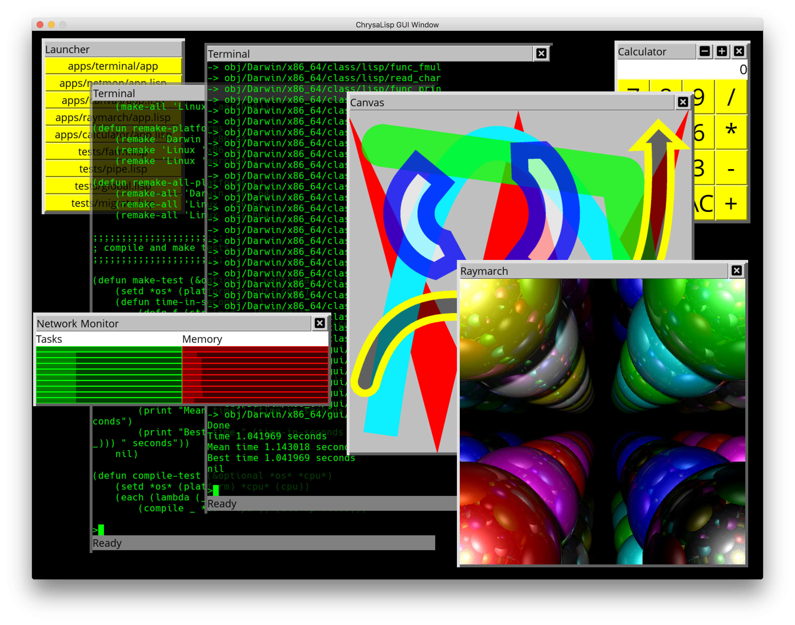

# ChrysaLisp

I have a torn retina ! Not sure how this happened, but just had laser treament
to weld things down. So not a lot of screen time at the moment !

------

Happy now with the polygon and stroking APIs after playing around with the new
analogue clock face demo. Makes a real difference the the flow of the source
code after rearranging the parameter ordering.

------

Implemented a set of long vector methods on the points class. Thinking along
the lines of numpy. Even though there not specifically for short 2D and 3D
vectors they have helped the Raymarch demo to go lots faster as far less churn
of objects happens.

Got plans to implement a genetic algorithm trained neural network 'evolving
bugs' demo using the long vectors as a way to shake down the API and tune
performance.

------

Implementation of system services allowed me to implement a multi-thread
debugger and single stepping logger. The Boing demo and Global tasks test now
exercise the features. New Debug app is in apps/debug/app.lisp, note there is
only Lisp code involved in this app. :)

------

Took a detour to create a C++ version of ChrysaLisp to directly compare with my
hand rolled compiler and format. The Lisp side of that project is now done and
can build the full OS from the same source files.

Based on comparison builds of the ChrysaLisp OS source using its own
compiler/assembler and the C++ version, ChrysaLisp native is around 2.5x faster
than the Clang C++ version.

The C++ Lisp executable on its own is currently 279kb, while the entire
ChrysaLisp OS including its compiler and Lisp and libraries, GUI etc, is 165kb.

https://github.com/vygr/ChrysaLisp-

Regards all

Chris
